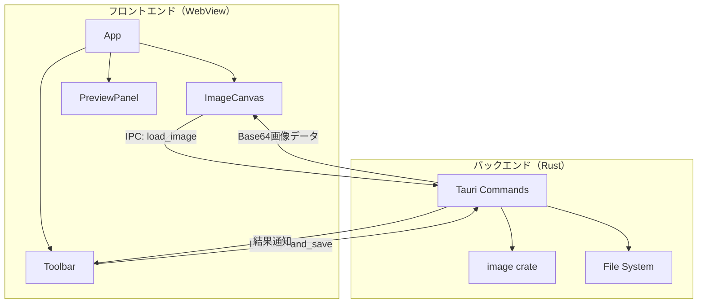

# imgX-Clip アーキテクチャ設計

**作成日**: 2026-03-11
**関連要件定義**: [requirements.md](../../spec/imgx-clip/requirements.md)
**ヒアリング記録**: [design-interview.md](design-interview.md)

**【信頼性レベル凡例】**:
- 🔵 **青信号**: EARS要件定義書・ユーザヒアリングを参考にした確実な設計
- 🟡 **黄信号**: EARS要件定義書・ユーザヒアリングから妥当な推測による設計
- 🔴 **赤信号**: EARS要件定義書・ユーザヒアリングにない推測による設計

---

## システム概要 🔵

**信頼性**: 🔵 *要件定義書・ユーザヒアリングより*

画像のY軸方向を指定範囲でクリップするWindowsデスクトップアプリケーション。
Tauri v2（Rust）をバックエンドに、React（TypeScript）をフロントエンドに使用する。
ユーザーは2本の水平線をドラッグして切り取り範囲を指定し、リアルタイムで拡大プレビューを確認しながら操作する。

## アーキテクチャパターン 🔵

**信頼性**: 🔵 *Tauri v2の標準アーキテクチャ*

- **パターン**: Tauri IPC（フロントエンド ↔ Rustバックエンド）
- **選択理由**: Tauri v2の標準パターン。UIはWebView（React）で描画し、画像処理はRust側で実行。IPCコマンドでフロントエンドとバックエンドを疎結合に接続する。

## コンポーネント構成

### フロントエンド（React + TypeScript） 🔵

**信頼性**: 🔵 *要件定義REQ-401・ユーザヒアリングより*

- **フレームワーク**: React 19 + TypeScript
- **状態管理**: React useState/useReducer（小規模アプリのため軽量に） 🟡
- **Canvas描画**: HTML Canvas API（画像表示・ドラッグ操作・オーバーレイ・プレビュー）
- **Tauri連携**: `@tauri-apps/api` でIPCコマンド呼び出し

**主要コンポーネント**:

| コンポーネント | 責務 | 信頼性 |
|---|---|---|
| `App` | アプリ全体のレイアウトと状態管理 | 🟡 |
| `ImageCanvas` | 画像表示・2本の水平線ドラッグ操作・オーバーレイ描画 | 🔵 |
| `PreviewPanel` | 選択範囲のリアルタイム拡大プレビュー表示 | 🔵 |
| `Toolbar` | ファイル読み込み・保存ボタン等の操作UI | 🟡 |

### バックエンド（Rust / Tauri） 🔵

**信頼性**: 🔵 *要件定義REQ-401・ユーザヒアリングより*

- **フレームワーク**: Tauri v2
- **画像処理**: `image` crate（画像読み込み・クリップ・保存）
- **ファイル操作**: Tauri dialog API（ファイル選択ダイアログ）

**IPCコマンド**:

| コマンド | 入力 | 出力 | 信頼性 |
|---|---|---|---|
| `load_image` | ファイルパス | 画像メタデータ（幅・高さ・形式）+ Base64データ | 🔵 |
| `clip_and_save` | ファイルパス, Y開始, Y終了, 保存先パス | 成功/失敗 | 🔵 |

## システム構成図



**信頼性**: 🔵 *Tauri v2標準パターン・要件定義より*

## ディレクトリ構造 🟡

**信頼性**: 🟡 *Tauri v2プロジェクトの標準構造から妥当な推測*

```
./
├── src/                    # フロントエンド（React）
│   ├── App.tsx             # メインコンポーネント
│   ├── components/
│   │   ├── ImageCanvas.tsx # 画像表示・ドラッグ操作
│   │   ├── PreviewPanel.tsx# 拡大プレビュー
│   │   └── Toolbar.tsx     # 操作ツールバー
│   ├── hooks/
│   │   └── useClipRegion.ts# ドラッグ状態管理フック
│   ├── main.tsx            # エントリーポイント
│   └── styles/
│       └── index.css       # スタイル
├── src-tauri/              # バックエンド（Rust）
│   ├── src/
│   │   ├── main.rs         # Tauriエントリーポイント
│   │   ├── commands.rs     # IPCコマンド定義
│   │   └── image_processor.rs # 画像処理ロジック
│   ├── Cargo.toml
│   └── tauri.conf.json
├── package.json
├── tsconfig.json
├── vite.config.ts
└── docs/
```

## 非機能要件の実現方法

### パフォーマンス 🟡

**信頼性**: 🟡 *NFR要件から妥当な推測*

- **ドラッグ操作の応答性**: Canvas再描画を`requestAnimationFrame`で最適化し60fps維持
- **プレビュー更新**: ドラッグ中はCanvas APIでクリップ範囲のみを再描画（全体再描画を避ける）
- **画像読み込み**: Rust側で読み込み→Base64変換→フロントエンドでCanvas描画。大画像でもRust側の処理は高速
- **クリップ処理**: Rust `image` crateのcrop機能を使用。メモリ効率が高い

### セキュリティ 🟡

**信頼性**: 🟡 *Tauri v2のセキュリティモデルから妥当な推測*

- **ファイルアクセス**: Tauri v2のCapability設定で必要最小限のファイルアクセスのみ許可
- **IPC**: Tauri v2の型安全なコマンド定義によりインジェクションを防止

## 技術的制約 🔵

**信頼性**: 🔵 *要件定義・環境情報より*

- Windows 11上で動作すること
- Tauri v2はWebView2（Edge）を使用するため、Windows 10 1803以降が必要
- 対応画像形式: PNG, JPG（`image` crateの対応範囲）

## 関連文書

- **データフロー**: [dataflow.md](dataflow.md)
- **要件定義**: [requirements.md](../../spec/imgx-clip/requirements.md)
- **ヒアリング記録**: [design-interview.md](design-interview.md)

## 信頼性レベルサマリー

- 🔵 青信号: 10件 (67%)
- 🟡 黄信号: 5件 (33%)
- 🔴 赤信号: 0件 (0%)

**品質評価**: ✅ 高品質
