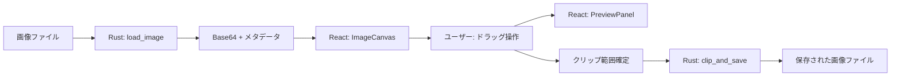
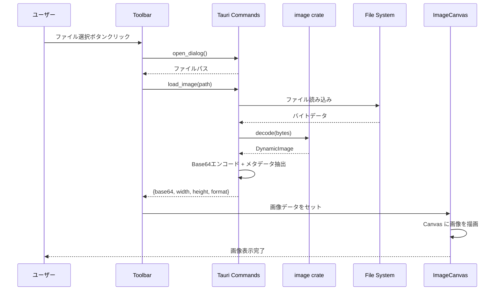
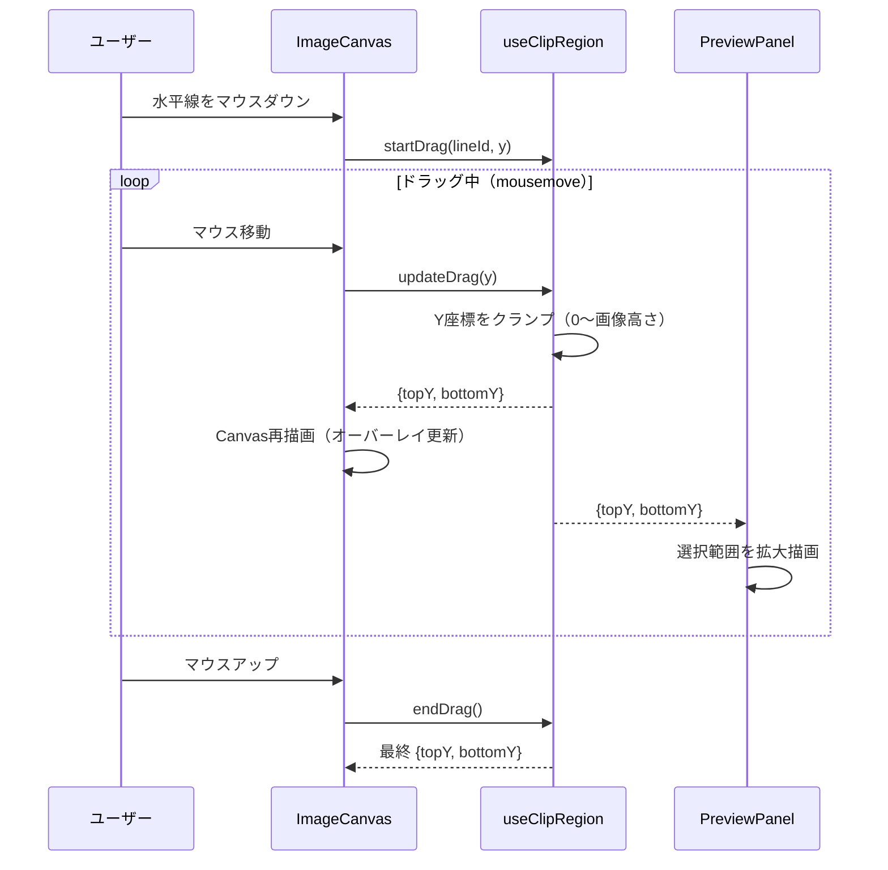
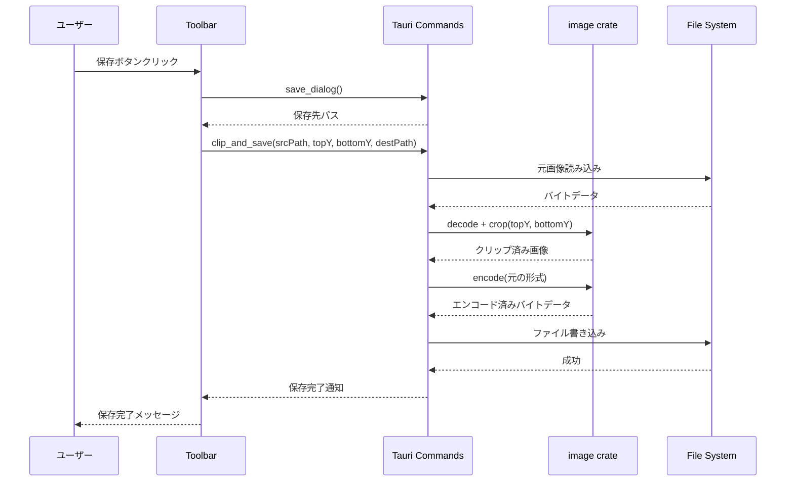
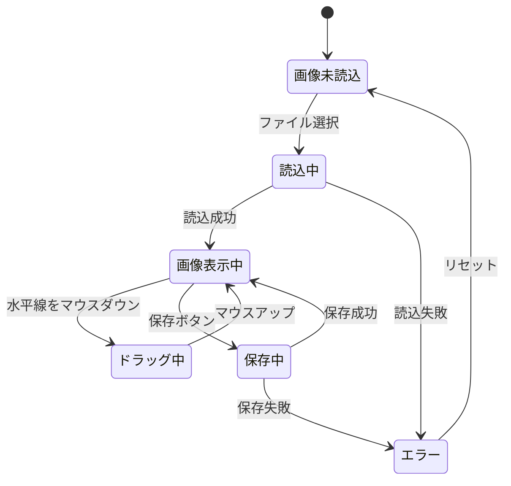
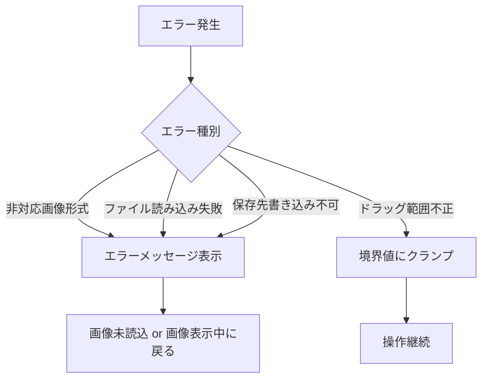

# imgX-Clip データフロー図

**作成日**: 2026-03-11
**関連アーキテクチャ**: [architecture.md](architecture.md)
**関連要件定義**: [requirements.md](../../spec/imgx-clip/requirements.md)

**【信頼性レベル凡例】**:
- 🔵 **青信号**: EARS要件定義書・ユーザヒアリングを参考にした確実なフロー
- 🟡 **黄信号**: EARS要件定義書・ユーザヒアリングから妥当な推測によるフロー
- 🔴 **赤信号**: EARS要件定義書・ユーザヒアリングにない推測によるフロー

---

## システム全体のデータフロー 🔵

**信頼性**: 🔵 *要件定義・ユーザーストーリーより*



## 主要機能のデータフロー

### 機能1: 画像読み込み 🔵

**信頼性**: 🔵 *要件定義REQ-001・受け入れ基準より*

**関連要件**: REQ-001



**詳細ステップ**:
1. ユーザーがToolbarの「ファイルを開く」ボタンをクリック
2. Tauriのファイルダイアログが開き、画像ファイルを選択
3. Rust側でファイルを読み込み、image crateでデコード
4. 画像をBase64エンコードし、幅・高さ・形式のメタデータとともにフロントエンドに返却
5. ImageCanvasがCanvas上に画像を描画、初期状態で2本の水平線を上端・下端に配置

### 機能2: ドラッグ操作とリアルタイムプレビュー 🔵

**信頼性**: 🔵 *要件定義REQ-002, REQ-004・ユーザヒアリングより*

**関連要件**: REQ-002, REQ-004



**詳細ステップ**:
1. ユーザーが上端または下端の水平線をマウスダウン
2. `useClipRegion`フックがドラッグ状態を管理
3. mousemoveイベントごとにY座標を更新（画像範囲内にクランプ）
4. ImageCanvasが選択範囲をオーバーレイで描画（選択外を半透明マスク）
5. PreviewPanelが選択範囲のみを拡大してリアルタイム描画
6. マウスアップでドラッグ終了、範囲確定

### 機能3: クリップと保存 🔵

**信頼性**: 🔵 *要件定義REQ-003・ユーザヒアリングより*

**関連要件**: REQ-003



**詳細ステップ**:
1. ユーザーがToolbarの「保存」ボタンをクリック
2. Tauriの保存ダイアログで保存先を選択
3. Rust側で元画像を再読み込みし、指定Y範囲でクロップ
4. 入力と同じ形式（PNG/JPG）でエンコード・保存
5. フロントエンドに完了通知を返却

## 状態管理フロー

### フロントエンド状態管理 🟡

**信頼性**: 🟡 *アプリ設計から妥当な推測*



**アプリ状態（useReducer）**:

```typescript
interface AppState {
  // 画像状態
  imagePath: string | null;
  imageData: string | null;      // Base64
  imageWidth: number;
  imageHeight: number;
  imageFormat: string;

  // クリップ範囲
  clipTopY: number;
  clipBottomY: number;

  // UI状態
  status: 'idle' | 'loading' | 'ready' | 'dragging' | 'saving' | 'error';
  errorMessage: string | null;
}
```

**信頼性**: 🟡 *要件から妥当な推測。実装時に調整の可能性あり*

## エラーハンドリングフロー 🟡

**信頼性**: 🟡 *要件の異常系テストケースから妥当な推測*



## 関連文書

- **アーキテクチャ**: [architecture.md](architecture.md)
- **要件定義**: [requirements.md](../../spec/imgx-clip/requirements.md)
- **ヒアリング記録**: [design-interview.md](design-interview.md)

## 信頼性レベルサマリー

- 🔵 青信号: 6件 (75%)
- 🟡 黄信号: 2件 (25%)
- 🔴 赤信号: 0件 (0%)

**品質評価**: ✅ 高品質
